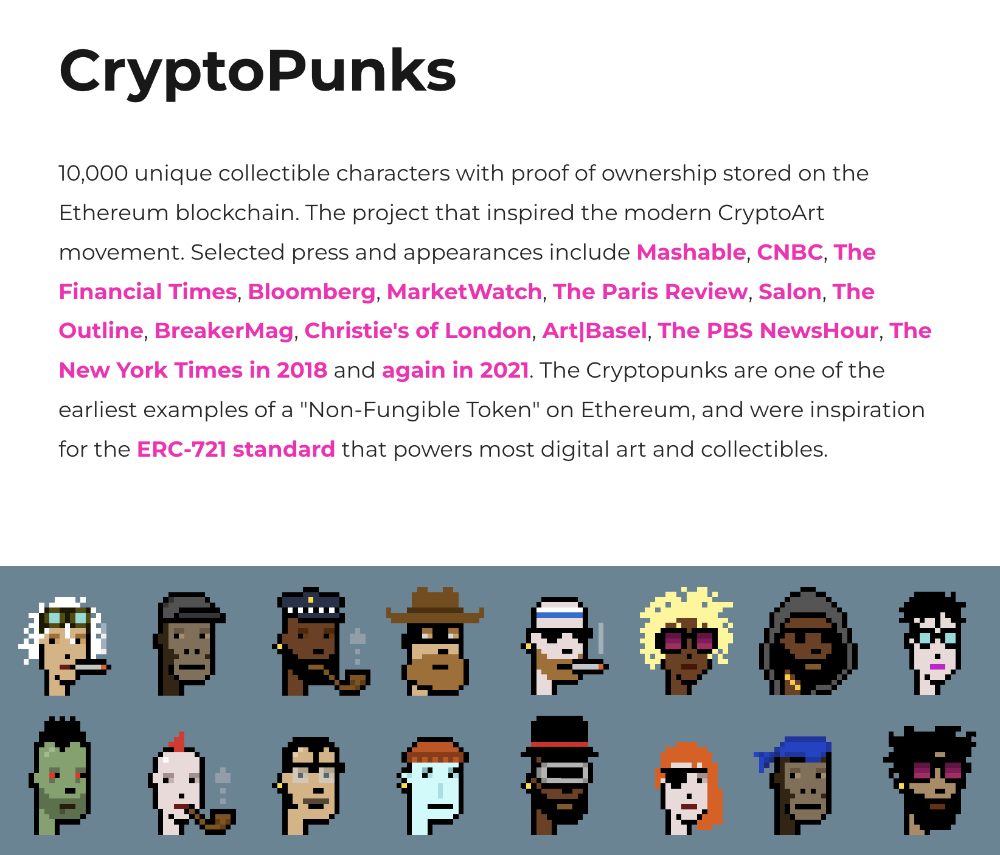
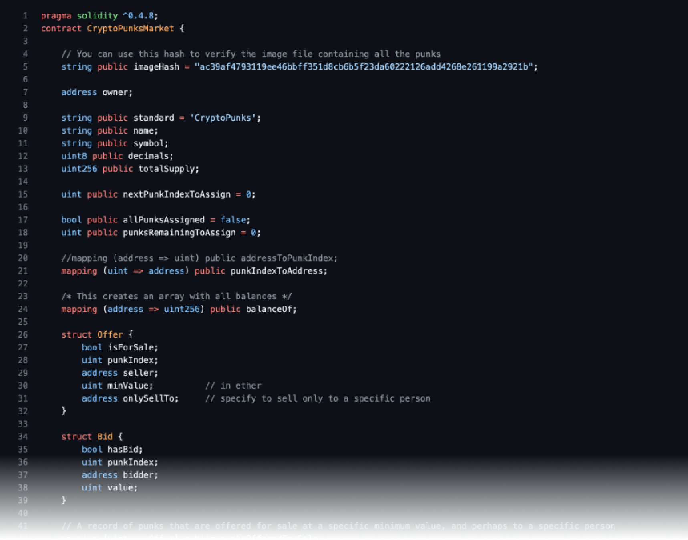
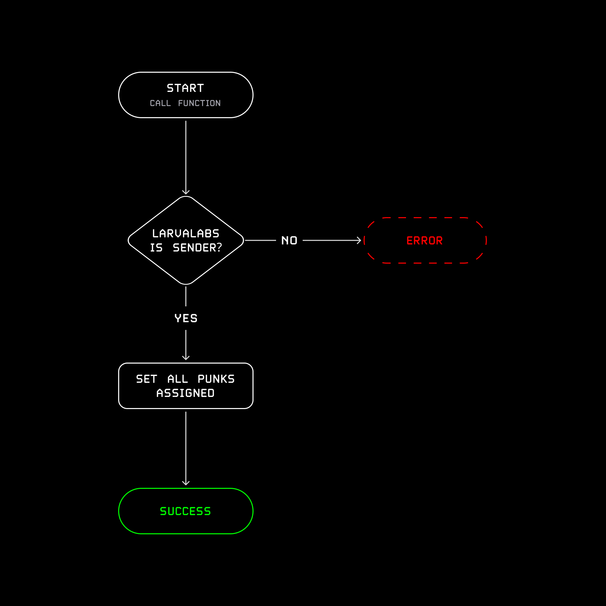

a small contribution to the celebration of punks...

# Intro

Us humans have always been collectors. We like to gather things, name things, and derive meaning from making that a shared experience with others.

In this little guide we want to explore the wild phenomenon of CryptoPunks together. Note – everything that's said is from our own personal lense & perspective, and doesn't necessarily represent the intent of the creators, owners, etc.. We'll go from a broad overview into the details of understanding actual code and core functionality.

# A High Level View

What in the world are CryptoPunks??!



> 10,000 unique collectible characters <br>
> with proof of ownership stored on the Ethereum blockchain. <br
> The project that inspired the modern CryptoArt movement. [...] <br>
> One of the earliest examples of a "Non-Fungible Token" [...].

Let's unpack.

## *1) 10,000 unique collectible characters*

Us humans have always been collectors. We like to gather things, name things, and derive meaning from making that a shared experience with others. Whether it's tangible things like gemstones or shells, watches or cars; less tangible things like books and art; or quite intangible things like ideas, knowledge, and insight. Collecting is what we do.
CryptoPunks just extend the scope in which we can collect items: The digital realm... Ten thousand 24×24 pixel portraits of punks, assembled from various individual traits like hairstyles and jewelry.

## *2) Proof of Ownership on the Ethereum Blockchain*

The Blockchain... Everyone has heard of it – "that thing where you can send digital money around". Well that's only a second order effect if you will. What the technology actually does is establish a shared log of historical events; a single source of truth of ***what*** happened ***when***.
This enables us to do much more than just send digital money back and forth – one of which is the tracking of ownership of any object over time.
CryptoPunks make use of this. When they launched, they came with code that processes changes in ownership of each individual punk. All changes have to go through this little program, which is immutable (meaning no one can change it) and unblockable (meaning no one can stop it). Anyone can prove who owns which punk, at any moment in time. 
The state of the Ethereum blockchain is validated by hundreds of thousands of computers, distributed around the entire globe. Anyone that wants to can participate in securing the network, and there is no entity that could come in to change any part of its state, unless they follow the rules set out by the blockchain itself, and these programs called "smart contracts".
For CryptoPunks, this piece of code is called the *"CryptoPunksMarket"* smart contract and we'll do a dive deep in a bit.

## *3) Inspired the modern CryptoArt movement [...]; One of the earliest examples of a "Non-Fungible Token"*

The worlds biggest artists, auction houses and brands are all in agreement: We live in a digitized world. This is just a new medium, like there have been new art forms in the past.. It's here to stay, and cryptography[^1] and blockchain technologies enable us to collect, own, and trade them on a global, borderless market.
Each object that's kept track of is called a "token". Tokens are identifiers for these objects, like the serial number of a car or the ISBN number of a book. And more specifically, in the case of most art, we refer to them as "non fungible tokens", because each identifier points to a unique piece, which can't be exchanged with another one to one.
CryptoPunks were the seminal art project of its kind; and caught fire like no other. It inspired various technological standards that were derived from it and spearheaded an entire movement of established and new artists and developers experimenting in this new paradigm.
And with every day, as more people and institutions join this new world to build, experiment, and collect, this special station of CryptoPunks is further solidified. In the end, all roads lead back to punks...

Today, are exhibited in the most prestigious Museums like the Centre Pompidou and the LACMA, a cultural phenomenon celebrated by icons from fashion, music, art and technology.
To date, the CryptoPunksMarket smart contract has processed billions of US$ in volume. Thousands of individual accounts have interacted with it, and over 6000 accounts have owned punks. The most traded punk has changed hands 51 times.

All that, handled by this little piece of code that runs on Ethereum... If one removes whitespace and comments, it's less than 200 lines of code. 

2.5+ billion $ of secure trading.
200 lines of code. 

Let that sink in...

A global community.
No middlemen or rent seekers.

Reflecting on this, it must become immediately clear, that this is a paradigm shift technology that has implications far beyond "just" digital art.

# The Art

==TODO==

# The Code



## Talking Computers

If you're not familiar with code at all, there are a few basics we have to cover. Software code is a set of statements that tell the thing running the code what to do... There are many many different languages, but they all share some general characteristics. For us, we're looking at "Solidity" code, which is the most common programming language used to develop Smart Contracts on Ethereum. It compiles to low level machine code that runs on the Ethereum Virtual Machine ("EVM"). We can think of the EVM as a virtualized computer that makes sure EVM code runs exactly the same on all machines participating in the network.

Open the [CryptoPunksMarket.sol](https://etherscan.deth.net/address/0xb47e3cd837dDF8e4c57F05d70Ab865de6e193BBB) code for the CryptoPunksMarket to follow along!
### Functions

Functions are the core building blocks of smart contracts. Most importantly, they make up our entry points to stuff our users aught to be able to do...

Think of a simple ATM machine. It basically has one function, "Withdraw Cash". This function would require one argument to be passed in: How much to withdraw. It would then perform all kinds of checks to make sure you can't withdraw more than what you're allowed, but as an external user, this "withdraw function" is all we really care about.

If we skim the code of the CryptoPunksMarket contract, we find a whole list of user facing functions that are relevant to us:

```solidity
// The initial distribution of punks
function setInitialOwner() {}
function setInitialOwners() {}
function allInitialOwnersAssigned() {}
function getPunk() {}

// For Punk Owners
function transferPunk() {}
function punkNoLongerForSale() {}
function offerPunkForSale() {}
function offerPunkForSaleToAddress() {}

// Execute Punk Purchases
function buyPunk() {}
function withdraw() {}

// Bids on Punks
function enterBidForPunk() {}
function acceptBidForPunk() {}
function withdrawBidForPunk() {}
```

If we just have a closer look at the first one for now:

```solidity
function setInitialOwner(address to, uint punkIndex) {
    // ...
}
```

This, we can read that as follows: The contract has a function to set the initial owner of a punk (`setInitialOwner`). It expects to be passed the account address (`to`) we want to make the owner of the punk, as well as which punk to send them (`punkIndex`, a number between 0 and 9,999).

These two data points are what we call "function arguments", and in Solidity they always come with a type (e.g. is this a number, a string, or something else).

One neat characteristic that helps programmers organize their code is that one function can call another. That way we can encapsulate a set of statements to do one specific, repeatable task.
For example, the `punkNoLongerForSale` function removes an existing sell-offer on a given punk. If we hunt for the places the `punkNoLongerForSale` function is used, we can see it's used in both the `transferPunk`, and `buyPunk` functions to ensure any existing sell-offer is cleared when the punk moves to another wallet.

==TBD side story==

### Variables and Data Types

Let's jump back up to the very first line in the marketplace code:

```solidity
imageHash = "ac39af4793119ee46bbff351d8cb6b5f23da60222126add4268e261199a2921b";
```

This is what we call a **variable assignment**. Variables are pointers to data we can refer to and play with within our programs. For this assignment specifically, if we try to find `imageHash` in any other place in the code, we see that's it's actually never changed. Hence we can actually call this a **constant**. The two prepending words `string`, and  `public` declare the type of data this constant points to (some text) and whether the contract exposes its value or keeps it private within the contract (this constant is public, meaning its value can be read by external accounts like us, or other smart contracts).
Even though it's not used anywhere else it's one of the most important lines in the entire contract. More on that in a bit. Let's continue looking at the next few lines...

```solidity
address owner;
```

This instantiates a variable of type `address` called `owner`, but doesn't assign any initial value to it. Every participant in the Ethereum network is identified by an `address`, which is a 40 hexadecimal character long string[^2]. 
Sidenote: This line refers to LarvaLabs themselves, the creators of the contract and will be set a bit further down during the "contract deployment" (the moment it's added to the Ethereum blockchain). This instantiation doesn't have the `public` declaration, so this variable is only accessible from within the contract code itself.

Jump a couple lines down:

```solidity
uint public nextPunkIndexToAssign = 0;
```

Here we assign the number zero (`0`) to a publicly accessible "unsigned (positive) integer" (`uint`) to the variable `nextPunkIndexToAssign`. Our contract keeps track of this variable ↔ value relationship so we can refer to it or update it easily throughout our code.

Bit further down:

```solidity
mapping (uint => address) public punkIndexToAddress;
```

This is a special kind of data structure: `punkIndexToAddress` points to something not unlike an Excel table with two columns. The first column refers to the punk identifier between 0 and 9,999; and the second column contains the address of the owner of the respective punk:

| Punk (`uint`) | Owner (`address`)                            |
|---------------|----------------------------------------------|
| `0`           | `0xe08c32737c021c7d05d116b00a68a02f2d144ac0` |
| `1`           | `0xb88f61e6fbda83fbfffabe364112137480398018` |
| `2`           | `0x897aea3d51dcba918c41ae23f5d9a7411671dee0` |
| ...           |  ...                                         |
| `9999`        | `0x2ee43f9a329623f4e97c29d813dff92ee968daee` |

To access the owner value for a punk, we use the following syntax:
```solidity
address punk0Owner = punkIndexToAddress[0];     // 0xe08c32...44ac0

address punk1Owner = punkIndexToAddress[1];     // 0xb88f6...98018

// Or if we were to use another variable:
uint punk = 2;
address punk2Owner = punkIndexToAddress[punk];  // 0x897ae...1dee0
```

More on statements like that later though...

First, let's look at an even more complex data structure:

```solidity
struct Offer {
	bool isForSale;
	uint punkIndex;
	address seller;
	uint minValue;
	address onlySellTo;
}

mapping (uint => Offer) public punksOfferedForSale;
```

Here, instead of using a single simple type like a `string` or an `address`, we define our own custom data structure, an `Offer`. The offer is a collection of simple types, we pack into one bundle for easy access:
- `isForSale`: A boolean (`true`/`false`) stating whether the offer is valid or not.
- `punkIndex`: The identifier for the offered punk
- `seller`: The address of the account making the sell-offer
- `minValue`: The asked price of the punk
- `onlySellTo`: An optional address to make the offer exclusive to one buyer.

The mapping itself looks something like this:

```json
{
	"0": {
		"isForSale": true,
		"punkIndex": 0,
		"seller": "0xe08c32737c021c7d05d116b00a68a02f2d144ac0",
		"minValue": 1001000000000000000000,
		"onlySellTo": "0x0000000000000000000000000000000000000000"
	},
	"1": {
		"isForSale": false,
		"punkIndex": 1,
		"seller": "0xb88f61e6fbda83fbfffabe364112137480398018",
		"minValue": 0,
		"onlySellTo": "0x0000000000000000000000000000000000000000"
	},
	"...": {},
	"9999": {
		"isForSale": true,
		"punkIndex": 9999,
		"seller": "0x2ee43f9a329623f4e97c29d813dff92ee968daee",
		"minValue": 9000000000000000000000,
		"onlySellTo": "0x0123456789012345678901234567890123456789"
	},
}
```

The above is a commonly used data structure called JSON (short for "JavaScript Object Notation") a simple key-value syntax which makes it easy to visualize hierarchical data. It reads as follows:

- Punk #0
	- is offered for sale (`"isForSale": true`)
	- by 0xe08c327...44ac0 (`"seller": "0xe08...44ac0"`)
	- for 1001 Eth (1001 billion billion Wei) (`"minValue": 1001000000000000000000`)
	- to anyone, openly on the market (`"onlySellTo": "0x000...000`)
- Punk #1 is not for sale (`"isForSale": false`)
- Punk #9999
	- is for sale
	- by 0x2ee43f9...8daee
	- for 9000 Eth
	- to 0x01234...6789 (`"onlySellTo": "0x01234...56789"`)

Alternatively we can map it out in a more traditional table like so:

| Punk (`uint`) | For Sale (`Order.isForSale`) | Seller (`Order.seller`) | Price (`Order.minValue`) | Recipient (`Order.onlySellTo`) |
|---------------|------------------------------|-------------------------|--------------------------|--------------------------------|
| `0`           | `true`                       | `0xe08c327...144ac0`    | `1001 Eth`               | –                              |
| `1`           | `false`                      | `0xb88f61e...398018`    | `0 Eth`                  | –                              |
| ...           | ...                          | ...                     | ...                      | ...                            |
| `9999`        | `true`                       | `0x2ee43f9...68daee`    | `9000 Eth`               | `0x0123456...456789`           |

With the above, we can truly appreciate this incredible characteristic of Ethereum smart contracts: That they can hold arbitrary state. But unlike a traditional database, the blockchain ensures the data is always available and never lost or tampered with.

Next up, we have an interesting data type: "Events". With all kinds of computation happening onchain, we need a way to inform the outside world of relevant changes to our state, so that applications (like the CryptoPunks Website) can display what's happening on the blockchain accordingly.

`event PunkTransfer(address indexed from, address indexed to, uint256 punkIndex);`

The above event declaration reads as follows: 

- This contract can emit a `PunkTransfer` event with three data points attached: 
	- `from` whom the punk was transferred (account address),
	- `to` whom it was transferred, 
	- and which punk was transferred (via its 0-9,999 `punkIndex` identifier)". 

Searching for the events in the contract we will see it used or "emitted" when a punk is sold or sent from wallet to wallet.

### Statements and Expressions

#### (Re-)Assignments

A variable is only really a variable when it changes, right? As mentioned above, variables point to values. And we can change what we point to over time (in Solidity, as long as their type remains the same).

If we look into the constructor of our Marketplace contract, we see the following code:

```solidity
// We set the owner to the caller of this function,
// which was Matt & John (LarvaLabs) themselves
owner = msg.sender;

// We set the total supply to ten thousand punks
totalSupply = 10000;

// We set the punks to assign initial owners to the total xsupply (10,000)
punksRemainingToAssign = totalSupply;

// We set the name to the string `CRYPTOPUNKS` and the symbol to `Ͼ`
name = "CRYPTOPUNKS";
symbol = "Ͼ";
```

All these assignments above either initially set or change the pointer of our variables to something new.

Check out line 95:

```solidity
allPunksAssigned = true;
```

We previous instantiated `allPunksAssigned` on line 17 with `false`, and change it to `true` in the `allIninitialOwnersAssigned()` function.

#### Control Flow

##### If this then that

Let's have a closer look at this `allInitialOwnersAssigned()` function, as well as the code that influences how it works. It's fairly simple:

```solidity
address owner = 0xC352B534e8b987e036A93539Fd6897F53488e56a;
allPunksAssigned = true;

function allInitialOwnersAssigned() {
	if (msg.sender != owner) throw;
	allPunksAssigned = true;
}
```

In here, we find a new piece of code we haven't seen yet; and "if" statement. Programs typically interpret and run one statement after another. But the type of programs we can build with just linear flow is very limited. That's why we have these special things that control the flow of our program and make it behave differently depending on context.



If we call the function as LarvaLabs, we assign the variable `allPunksAssigned` to `true`.
If anyone else calls the function, it throws an error and the transaction is reverted.

But we're already getting too much in the nitty gritty...

##### Loops

Let's have a look at the `setInitialOwners` function. Here we find a new type of control flow, a "for loop".

```solidity
function setInitialOwners(address[] addresses, uint[] indices) {
	uint n = addresses.length;
	for (uint i = 0; i < n; i++) {
		setInitialOwner(addresses[i], indices[i]);
	}
}
```

The for-loop itself reads as follows:
1. `i` is zero
2. as long as `i` is less than `n`, run the code within the for loop (`setInitialOwner(...)`)
3. after each iteration, increment `i` by 1
4. if `i` is equal or greater than `n`, exit the loop and continue with the code below the loop section

The function expects two arguments, each containing a list of items. They would look something like this:

```solidity
addresses = [0x01234, 0x56789, 0xabcde];
indices   = [100,     101,     102];
```

If we were to call the function with these inputs, we can imagine the flow of this code like so:

```solidity
setInitialOwners(addresses, indices)      // setInitialOwners(
                                          //     [0x01234, 0x56789, 0xabcde],
                                          //     [100, 101, 102]
                                          // );

uint n = addresses.length;                // n = 3
uint i = 0;                               // i = 0

// First Iteration...
i < n;                                    // 0 < 3 = true
setInitialOwner(addresses[i], indices[i]) // setInitialOwner(0x01234, 100)
i++;                                      // i = 1

// Second Iteration...
i < n;                                    // 1 < 3 = true
setInitialOwner(addresses[i], indices[i]) // setInitialOwner(0x56789, 101)
i++;                                      // i = 2

// Third Iteration...
i < n;                                    // 2 < 3 = true
setInitialOwner(addresses[i], indices[i]) // setInitialOwner(0xabcde, 102)
i++;                                      // i = 3

// Exit Loop
i < n;                                    // 3 < 3 = false
```

If you've gotten this far – congratulations! Code might look intimidating at first, but if we spend the time to go through it step by step it turns out it's not at all that bad...

## Actors & Actions

Something i like to do when looking at code, is making a model of it, in terms of "Subjects", "Objects", and "Verbs" or "Actions".

First, as the "subjects", we have people interacting with the smart contract. In Blockchain land, we call these "Accounts"[^3].

If we map out the contract on a high level, we can identify:
- Subjects: `ContractOwner`, `PunkOwners`, `Bidders`
- Objects: `Punks`, `Bids`, `Offers`
- Actions: `assign`[^4], `transfer`, `bid`, `acceptBid`, `withdrawBid`, `offerForSale`, `buy`, `withdrawEther`

We can rephrase the above to the following:

Entities can...
- get punks assigned
- transfer punks
- offer punks for sale
- buy punks
- make, withdraw, and accept bids on punks
- withdraw sale proceeds


==CONTINUE==


## Buying a Punk

## Offering a Punk for Sale

### General Market Offer

### Private Offer

### Cancel an Offer

## Bidding Market

### Checking Bids on Punks

### Biding on a Punk

### Accept Bids on a Punk

#### Sneaky Bids

### Withdraw a Bid

## Ether Withdrawals

## Initial Distribution of Punks

### Claiming Punks

### A Marketplace Bug

### The fixed CryptoPunksMarketplace

# Further Readning

## Wrapped CryptoPunks: The ERC721 Wrapper

## On Chain Punks


---

[^1]: Participants don't have to trust each other, even in the presence of bad actors. Cryptography has enabled us to have private conversations online, and similarly its techniques can now be used to have asdkfja;lsdjf;asldjf;asldkfj

[^2]: Addresses are derived from... asdf;jsadfsaldkjhfalk

[^3]: Most blockchains use private-public key cryptography to enable self governed participation in the network. Key pairs controlled by entities (e.g. people) 

[^4]: The early story of CryptoPunks is actually split into two contracts: The initial claim, and the reassignment to the original claimers after a bug was found in the first version of the contract.


